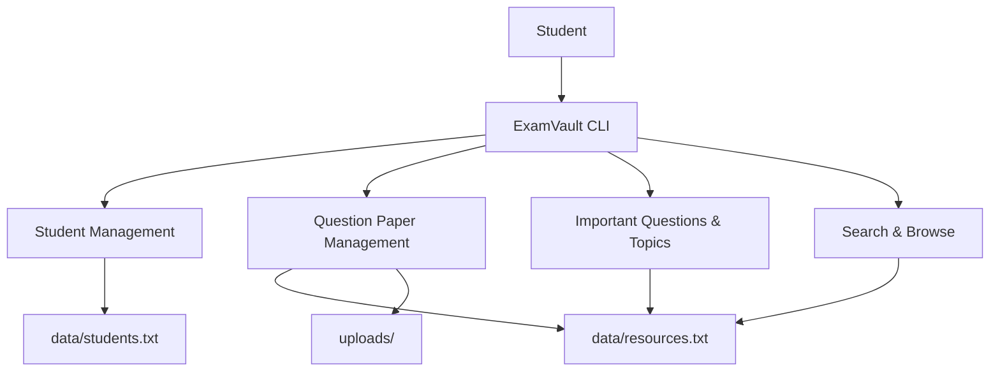

# Architecture Diagram

```mermaid
flowchart TD
    A[Student] --> B[ExamVault CLI]
    B --> C[Student Management]
    B --> D[Question Paper Management]
    B --> E[Important Questions & Topics]
    B --> F[Search & Browse]
    C --> G[data/students.txt]
    D --> H[data/resources.txt]
    D --> I[uploads/]
    E --> H
    F --> H
```
