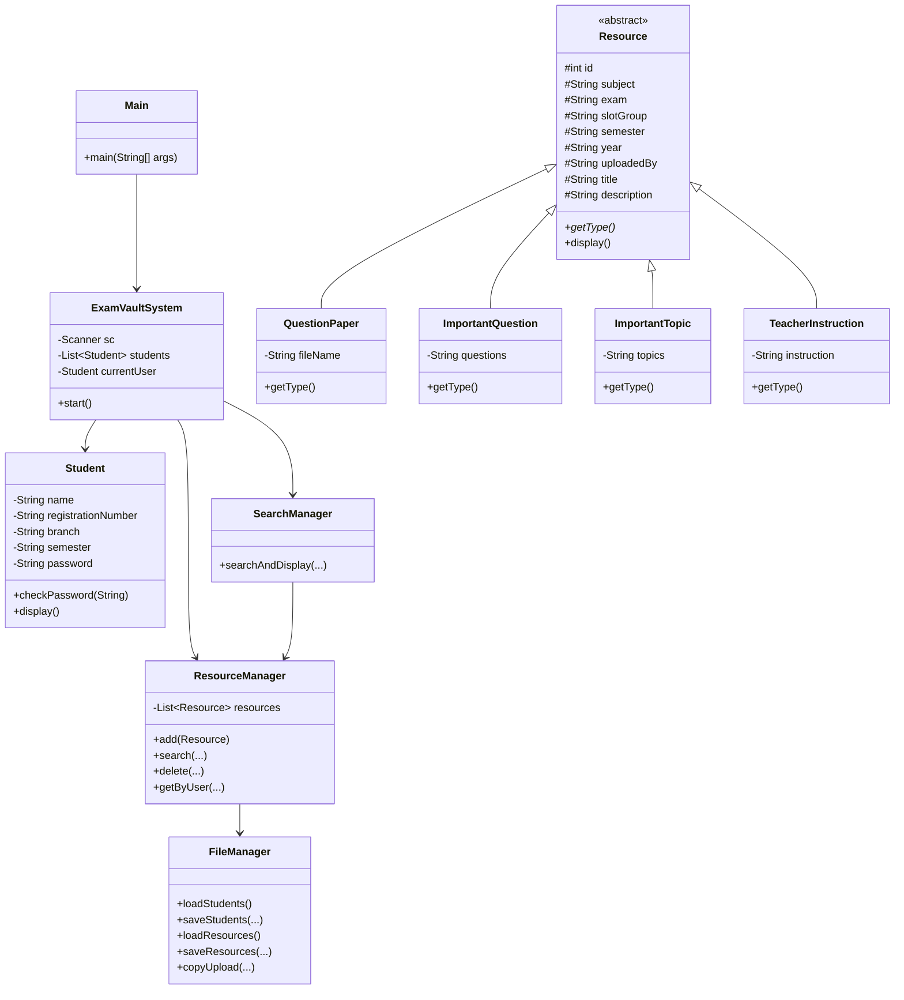

# Class Diagram

```mermaid
classDiagram
    class Main {
        +main(String[] args)
    }

    class ExamVaultSystem {
        -Scanner sc
        -List~Student~ students
        -Student currentUser
        +start()
    }

    class Student {
        -String name
        -String registrationNumber
        -String branch
        -String semester
        -String password
        +checkPassword(String)
        +display()
    }

    class Resource {
        <<abstract>>
        #int id
        #String subject
        #String exam
        #String slotGroup
        #String semester
        #String year
        #String uploadedBy
        #String title
        #String description
        +getType()*
        +display()
    }

    class QuestionPaper {
        -String fileName
        +getType()
    }

    class ImportantQuestion {
        -String questions
        +getType()
    }

    class ImportantTopic {
        -String topics
        +getType()
    }

    class TeacherInstruction {
        -String instruction
        +getType()
    }

    class ResourceManager {
        -List~Resource~ resources
        +add(Resource)
        +search(...)
        +delete(...)
        +getByUser(...)
    }

    class SearchManager {
        +searchAndDisplay(...)
    }

    class FileManager {
        +loadStudents()
        +saveStudents(...)
        +loadResources()
        +saveResources(...)
        +copyUpload(...)
    }

    Resource <|-- QuestionPaper
    Resource <|-- ImportantQuestion
    Resource <|-- ImportantTopic
    Resource <|-- TeacherInstruction
    ExamVaultSystem --> Student
    ExamVaultSystem --> ResourceManager
    ExamVaultSystem --> SearchManager
    ResourceManager --> FileManager
    SearchManager --> ResourceManager
    Main --> ExamVaultSystem
```
