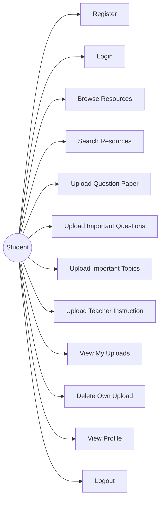

# Use Case Diagram

```mermaid
flowchart LR
    S((Student))

    S --> A[Register]
    S --> B[Login]
    S --> C[Browse Resources]
    S --> D[Search Resources]
    S --> E[Upload Question Paper]
    S --> F[Upload Important Questions]
    S --> G[Upload Important Topics]
    S --> H[Upload Teacher Instruction]
    S --> I[View My Uploads]
    S --> J[Delete Own Upload]
    S --> K[View Profile]
    S --> L[Logout]
```
