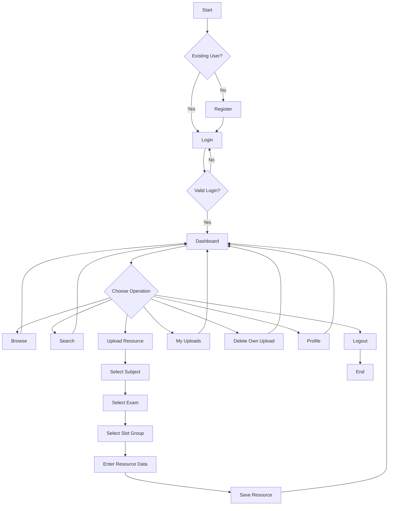

# Workflow Diagram

```mermaid
flowchart TD
    A[Start] --> B{Existing User?}
    B -->|No| C[Register]
    B -->|Yes| D[Login]
    C --> D
    D --> E{Valid Login?}
    E -->|No| D
    E -->|Yes| F[Dashboard]

    F --> G{Choose Operation}
    G --> H[Browse]
    G --> I[Search]
    G --> J[Upload Resource]
    G --> K[My Uploads]
    G --> L[Delete Own Upload]
    G --> M[Profile]
    G --> N[Logout]

    J --> O[Select Subject]
    O --> P[Select Exam]
    P --> Q[Select Slot Group]
    Q --> R[Enter Resource Data]
    R --> S[Save Resource]
    S --> F

    H --> F
    I --> F
    K --> F
    L --> F
    M --> F
    N --> T[End]
```
